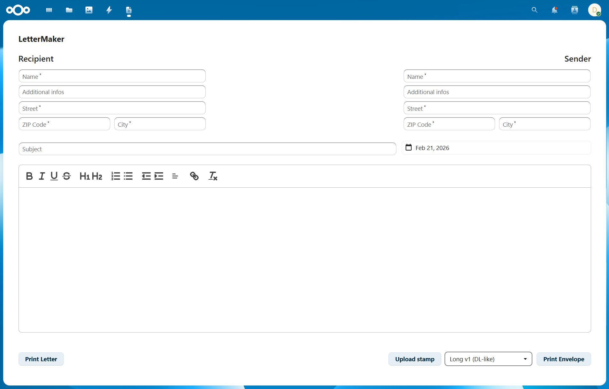

# LetterMaker
An easy-to-use Nextcloud app for creating letters and envelopes using custom templates.

## Features
- Generate letters as PDF
- Generate envelopes as PDF (with or without custom stamps)
- Manage templates as an Admin

## Requirements
- Nextcloud **31+**
- Composer
- Node.js + npm

## Usage
1. Open **LetterMaker** in Nextcloud.
2. Fill in sender/recipient, set subject and date, write your text in the editor.
3. **"Print Letter"** downloads the letter as a PDF.
4. Select an envelope template, optionally upload a stamp as PDF, then click **"Print Envelope"**.

> To use the Stamp feature in combination with the default templates, please select the format **"Seiko SLP-Stamp 1 42x36"** when purchasing.

## Template Format
Templates are HTML files with metadata embedded in the `<style>` block (as comments). For a template to work correctly, **the template ID and filename should match**:
- Filename: `my-template.html`
- Metadata: `/* @template-id: my-template */`

### Required Metadata
- `/* @template-type: letter|envelope */`
- `/* @template-id: ... */`
- `/* @template-name: ... */`

### Page Size / Format
- `/* @template-width: 220mm */`
- `/* @template-height: 110mm */`

### Stamp Placement (envelopes only, optional)

- `/* @stamp-position-x: 160 */`
- `/* @stamp-position-y: 5 */`
- `/* @stamp-width: 54.6 */`
- `/* @stamp-height: 45.5 */`
- `/* @stamp-rotation: -90 */` *(optional)*

### Placeholders

| Placeholder | Description |
|---|---|
| `{sender_name}` | Sender's full name |
| `{sender_info}` | Additional sender info |
| `{sender_street}` | Sender's street address |
| `{sender_zip}` | Sender's ZIP code |
| `{sender_city}` | Sender's city |
| `{recipient_name}` | Recipient's full name |
| `{recipient_info}` | Additional recipient info |
| `{recipient_street}` | Recipient's street address |
| `{recipient_zip}` | Recipient's ZIP code |
| `{recipient_city}` | Recipient's city |
| `{date}` | Letter date |
| `{subject}` | Letter subject |
| `{lettertext_html}` | HTML from the editor |

## Disclaimer
The standard templates are based on DIN standards but differ in certain aspects. They are provided for guidance purposes only and may vary depending on individual print settings. Therefore, no liability or warranty is assumed.

## License
AGPL-3.0